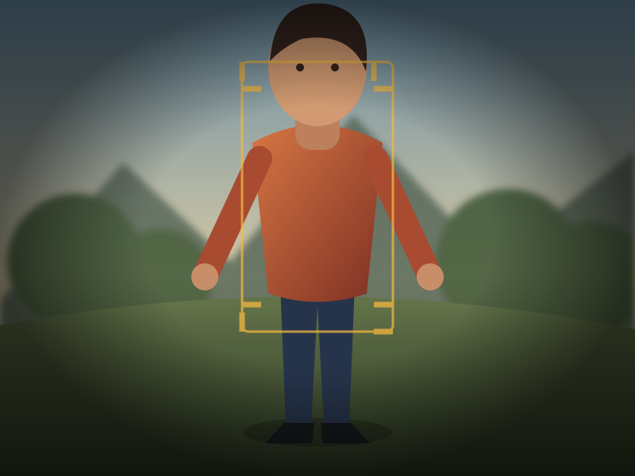

<div align="center">

# 📷 Photography Lab

### Learn photography by changing camera settings—and seeing what happens.

<a href="https://imelanthirayan.github.io/PhotographyLab/" target="_blank">
  
</a>


<br>

Visit the published app: [Photography Lab](https://imelanthirayan.github.io/PhotographyLab/)

<br>



</div>

---

## 🟡 How to Use

Open the Photography Lab website and choose an experiment from the navigation
bar.

| 🟠 **01 — CHOOSE** | 🔵 **02 — ADJUST** | 🟢 **03 — OBSERVE** |
|:---:|:---:|:---:|
| Select a concept | Move the camera controls | Watch the image react |

---

## 🟠 Experiments

| | **Lab** | **Explore** |
|:---:|---|---|
| 🟡 | **Aperture** | Background blur and depth of focus |
| 🔵 | **Shutter Speed** | Motion blur and frozen action |
| 🟣 | **ISO** | Brightness and image grain |
| 🟠 | **White Balance** | Cool and warm color tones |
| 🔆 | **Exposure** | Highlight and shadow detail |
| 🟢 | **Focus** | Sharpness at different distances |
| 🔺 | **Exposure Triangle** | Aperture, shutter speed, and ISO together |
| 📷 | **Camera Simulator** | Framing, perspective, field of view, and blur |
| 🖼️ | **RAW vs JPG vs HEIF** | Editing latitude, detail, compression, and file-size trade-offs |

---

## 🔵 Camera Simulator

The Camera Simulator shows how a photographer’s choices affect the same scene.

### 🟡 `01` Focal Length

Choose a preset or move the slider:

<div align="center">

**`16mm`　`24mm`　`35mm`　`50mm`　`85mm`　`135mm`　`200mm`**

</div>

| **WIDE · SHORT FOCAL LENGTH** | **TELEPHOTO · LONG FOCAL LENGTH** |
|:---:|:---:|
| Wider view · More surroundings · Smaller subject | Narrower view · Tighter framing · Larger subject |

### 🟠 `02` Aperture

| **WIDE APERTURE** | **NARROW APERTURE** |
|:---:|:---:|
| Lower f-number · Softer background | Higher f-number · More depth appears sharp |

### 🟢 `03` Camera Position

Move the camera closer to or farther from the subject.

| **MOVE CLOSER** | **MOVE FARTHER** |
|:---:|:---:|
| Larger subject · Tighter portrait | Smaller subject · More surrounding space |

### 🔵 `04` Camera View

| **Field of view** | **Camera position** | **Framing** | **Background blur** |
|:---:|:---:|:---:|:---:|
| How wide the lens sees | Distance from the subject | Subject size in the frame | Estimated blur strength |

### 🟣 `05` Depth of Field

The compact diagram below the camera view shows:

```text
CAMERA  ─────────  SUBJECT  ─────────  BACKGROUND
                       │
                 focused distance
```

The highlighted range shows what appears acceptably sharp. Change focal length,
aperture, or camera position and watch the range update.

---

<div align="center">

<sub>🟡 DESIGNED & DEVELOPED BY</sub>

**[Elanthirayan Madhavan](https://imelanthirayan.github.io/)**

</div>
